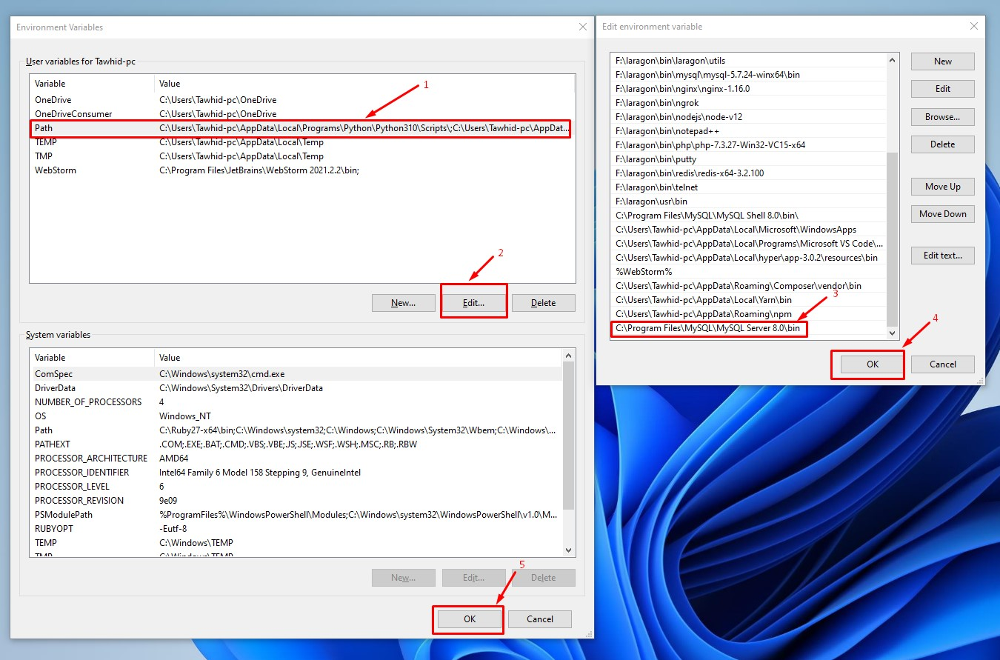

## Mysql windows cmd environment setup

### Step 1: Copy Mysql environment path which Drive installation your mysql workbench application.

```
Example:

C:\Program Files\MySQL\MySQL Server 8.0\bin
```

### Step 2:


